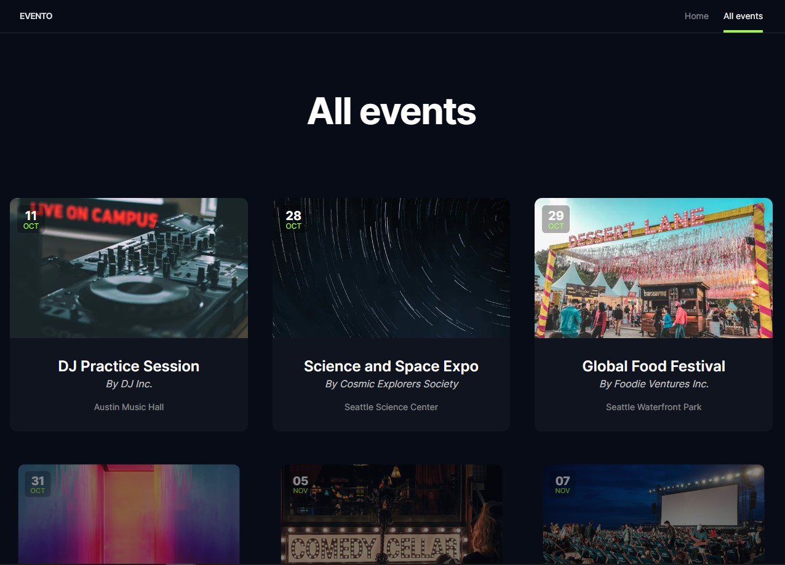

# Evento

## Overview

Individual project

Embark on a journey of global event discovery with the "Evento" web application. Whether you're a fan of cultural festivals, a sports enthusiast, or someone seeking the latest in entertainment, this platform provides a seamless and intuitive experience to explore and connect with events happening around the world.

## Features

- Search events by city
- Pagination
- Animation with Framer-motion
- Responsive design for optimal viewing on different devices
- Skeleton component for showcasing the loading process

## Technologies Used

##

> Developed by Dmytro Stas

